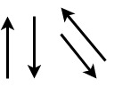
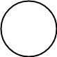
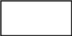
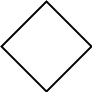
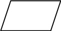

# Flowcharts

[Back to Syllabus](../README.md)

## Table of Contents

- [Introduction](#intro)
- [Symbols](#symbols)
- [input()](#input)
- [Integers / Floats](#numbers)

### Introduction

When first examining a programming problem, it can be a little overwhelming thinking about where to start. Therefore, it helps to try to split the problem into as many pieces as possible. Then we can work on solving the smaller problems which will work together to solve the overarching problem.

Flowcharts are a great tool for helping organize the logical flow of a program before we write the actual code.

A flowchart is a type of diagram that represents a workflow or process. A flowchart can also be defined as a diagrammatic representation of an algorithm, a step-by-step approach to solving a task.

### Symbols

Flowcharts use different shapes to represent different data, processes and decisions that will make up the program.

| Symbol                                               | Name         | Description                                                                                                                                   |
| ---------------------------------------------------- | ------------ | --------------------------------------------------------------------------------------------------------------------------------------------- |
|       | Flow Arrows  | Shows the process's order of operation. A line coming from one symbol and pointing at another.                                                |
|         | Terminal     | Indicates the beginning and ending of a program. They usually contain the word "Start" or "End"                                               |
|          | Process      | Represents an operation that changes data.                                                                                                    |
|           | Decision     | Shows a conditional operation that determines which one of the two paths the program will take. Commonly a yes/no question or true/false test |
|  | Input/Output | Indicates the process of entering or displaying data.                                                                                         |

[Back to top](#top)

---

### Example 1

In this example a variable containing a string representing a color will be defined and then displayed in the terminal.

[Back to top](#top)

### input()

### Numbers

## Lab 02: [Mad Libs](https://github.com/PdxCodeGuild/Programming101/blob/master/labs/madlibs.md)

[Back to top](#top)
