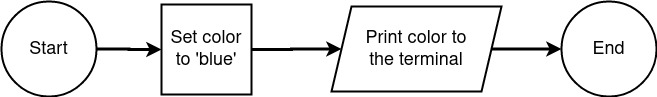

# Flowchart Example 1

In this example a variable containing a string representing a color will be defined and then displayed in the terminal.

---

## [Example 2 >](#)

### [<< Back to Flowcharts](/docs/flowcharts/)
