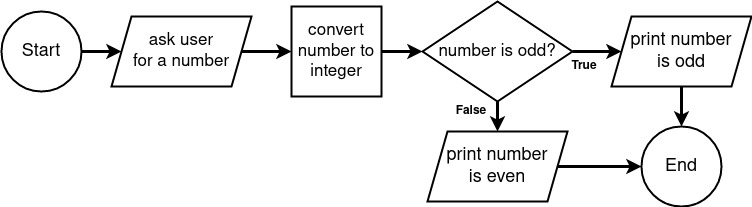

# Flowchart Example 2 - Even or Odd?

In this example the user will be asked to enter a number, which will be converted from a string to an integer. Then the program will output whether the number is even or odd.



Notice:

- A rectangle is used when converting the number from string to integer
- A diamond shape is used when making the decision whether or not the user's number is even or odd. Two different paths diverge from it to represent the different outcomes of the decision.

### Code:

```python
# begin program

# ask the user for a number
number = input('Please enter a number: ')

# convert the number from string to integer
number = int(number)

# number is odd?
if number % 2 == 1:
    # print number is odd
    print(f'{number} is odd.')

else:
    # print number is even
    print(f'{number} is even.')

# end program
```

---

## [< Example 1](./flowchart_example_1.md)| [Example 3 >](./flowchart_example_3.md)

### [<< Back to Flowcharts](/docs/flowcharts/)
