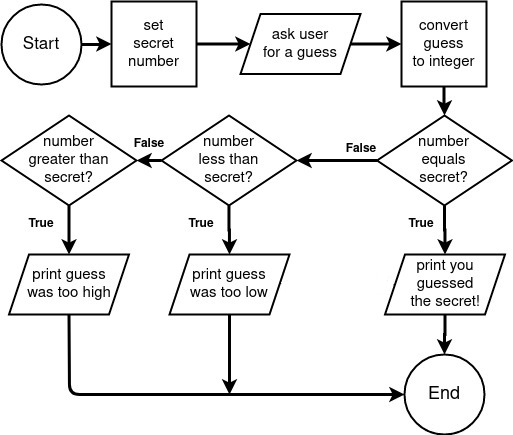

# Flowchart Example 3 - Guess the Number

In this example a variable will be defined to represent a secret number. The user will be asked to guess a number between 1 and 10, which will be converted from a string to an integer. Then the program will output whether the number is greater than, less than or equal to the secret number.



### Code:

```python
# begin program

# set secret number
secret = 5

# ask the user for a guess
guess = input('Please guess a number 1-10: ')

# convert the number to an integer
guess = int(number)

# guess equals secret?
if guess == secret:
    # print you guessed the secret!
    print(f'You guessed the secret number: {secret}')

# guess less than secret?
elif guess < secret:
    # print guess was too low
    print(f'Your guess of {guess} was too low!')

# guess greater than secret?
elif guess > secret:
    # print guess was too high
    print(f'Your guess of {guess} was too high!')

# end program
```

---

## [< Example 1](./flowchart_example_1.md)| [Example 3 >](./flowchart_example_3.md)

### [<< Back to Flowcharts](/docs/flowcharts/)
