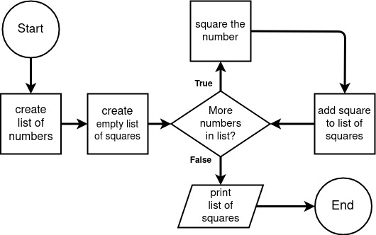

# Flowchart Example 4 - Square the Numbers

In this example we will loop through a list of integers and print the square of each number.



Notice:

The loop is running until it gets through the last number in the list. Once the last in the list is squared and added to the list, the loop ends.

### Code:

```python
# begin program

# create list of numbers
numbers = [11, 22, 33, 44, 55]

# create empty list for squares
squares = []

# loop through all numbers
for num in numbers:
    # square the number
    num_squared = num ** 2

    # add the square to the list of squares
    squares.append(num_squared)

# print the list of squares
print(squares)
```

---

## [< Example 3](./flowchart_example_3.md)

### [<< Back to Flowcharts](/docs/flowcharts/)
