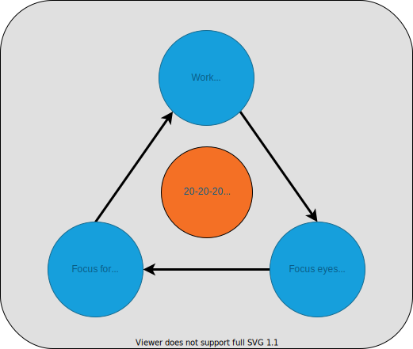
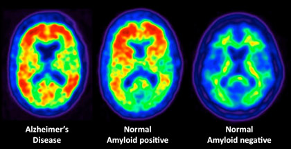

<h2 align="center">The Mind-Body Connection</h2>

<a href="#tldr">TL;DR</a> 

---

 

When beginning the process of learning something new, it’s important to point out the inescapable connection between body and mind.

Between reading books, taking notes, analyzing data, reciting information, and drawing connections between topics, it’s easy to become so engrossed in studying that we begin to neglect our basic needs. We forget to drink enough water, stand up and get our hearts pumping, or practice focusing our eyes on subjects beyond our computer screen.

Our brains need blood flow and proper hydration to work at their peak efficiency and our spirits need new and varied experiences to stay motivated and curious.

<h3>Physical activity enhances and optimizes:</h3>

||||
|-|-|-|
|Thinking|Learning|Judgement|
|Alertness|Attention|Motivation|

 
 

Because exercise prepares and encourages nerve cells to bind to one another, it spurs the development of new connections in the brain. In short, **not only does exercise help the brain get ready to learn but it actually makes retaining information easier.**

 

    <h2>Let’s Get Moving!</h2>

According to the _World Health Organization_, **adults 18-64** years of age should participate in **two and a half to five hours** of moderate physical activity each week (about **thirty minutes, five days a week**) in order to maintain a baseline of physical and mental health.

In addition, adults should intake **two to four liters of water** a day. This amount may vary depending on activity levels, environment and overall health, but it is a good goal to shoot for.

Maintaining a healthy lifestyle will compliment one’s learning process and lead to deeper understanding of the material with less stress.

 

    <h2>Nature Heals</h2>

Too much sedentary time in front of screens can have detrimental effects on our physical and mental well-being.

In a study of 20,000 people, the European Centre for Environment & Human Health at the University of Exeter found that **people who spent at least _two hours a week_ in green spaces like local parks or other natural environments were substantially more likely to report good health and psychological well-being than those who didn’t.**

 

    <a href="#top">Back to top &mapstoup;</a>

---

    <h2>Love Your Eyes</h2>

Prolonged staring at a computer screen that’s no more than an arm’s length away can lead to a unique form of eye-strain, called **Computer Vision Syndrome** (CVS).

 

<h3>CVS Symptoms: </h3>

Blurred or double vision

Dry eyes

Eye discomfort & fatigue

Eye itching, redness & tearing
   

Headaches
    

Neck & shoulder pain

 
 

## Studies show that up to **90%** of people who spend three or more hours per day with a digital device are affected by one or more of the symptoms of Computer Vision Syndrome.

 
 
 
In a survey by the American Optometric Association...
 
**62%** of respondents spent at least **five hours a day** using a digital device

**14%** spent upwards of **ten hours a day** in front of a screen.

 

<h3>These things will also increase the risk of CVS: </h3>

Screen glare  

Poor lighting  

Poor posture  

Improper viewing distance and angle

Uncorrected vision Problems

Not taking enough breaks while working

  

Computer Vision Syndrome is a result of poor screen-usage habits and in order to undo their effects, they must be corrected and replaced with healthier patterns of behavior.

Luckily, the strategies for combating Computer Vision Syndrome are easy to implement and require only small adjustments to begin practicing them.

 

## Here are three of the simplest changes we can make to our routine:

 

### 1. Drink more water

Our bodies are mostly water, and our eyes are no exception. Keeping ourselves hydrated will help our eyes to produce the tears necessary to lubricate them.

**We blink up to \***66%**\* less while using a computer, so be sure to blink often.**

 
 

### 2. Adjust Screen Distance and Angle

|          |                                                                       |
| -------- | --------------------------------------------------------------------- |
| Distance | **20 to 28 inches from our eyes** (or about a full arm’s length away) |
| Height   | Top of the screen at **eye level**                                    |
| Distance | Tilted back **10-20 degrees**                                         |

 
 

### 3. Practice the "10-20-20" Rule

 

The “20-20-20” Rule is a technique designed to help alleviate the symptoms of Computer Vision Syndrome.

According to the “20-20-20” Rule, after every **twenty-minute working interval**, we should focus our eyes on a subject at least **twenty feet away** for at least **twenty seconds**.

This helps strengthen the muscles responsible for seeing far away and prevents the muscles around the eyes from becoming too accustomed to only focusing at a short distance.

 

Click [here](./combatting_computer_vision_syndrome.md) for more ideas for combatting Computer Vision Syndrome.

 
 

    <a href="#top">Back to top &mapstoup;</a>

---

## Blue Light & Sleep

 

As technology evolves, people are growing more and more accustomed to a digital lifestyle. As our use of smartphones, tablets, LED monitors and flatscreen TVs increases, so does our exposure to blue light. While the amount of blue-colored light we take in might not seem that important, too much exposure to blue light can have a wide range of negative health effects.

 
 

 
 

## Circadian Rhythm

 

Often referred to as our **“biological clock”**, our **circadian rhythm** is a **finely-tuned, 24-hour cycle** that helps our bodies know when to carry out essential functions like eating and sleeping.

The phrase gets its name from the Latin _"circa diem"_, meaning _"around a day"_.

**Light is the most important factor in aligning circadian rhythms.** While all types of visible light can affect circadian rhythms, blue light has the largest impact.

For much of human history, our sleep cycles were closely aligned with sunrise and sunset, but with the advent of artificial light and electronics, we are being exposed to increasing amounts of light before bedtime.

Blue light suppresses the body’s release of melatonin, a hormone that makes us feel drowsy. While this may be useful during the day, it becomes unhelpful at night when we’re trying to sleep.

**Being exposed to blue light in the evening can trick our brain into thinking it’s still daytime**, disrupting circadian rhythms and leaving us feeling alert instead of tired.

 

<h3>Reducing blue light: </h3>

Blue-light-filtering glasses / contacts / screen covers

Change screen settings to minimize blue light   

Download an app to automatically reduce blue-light at night 

Upgrade CRT TVs and monitors

Stop using screens one hour before bed

 
 

An improper sleep schedule can lead to a multitude of other chronic health problems, such as depression, anxiety, high blood pressure, and even certain types of cancer, so we can definitely start to see the importance of doing everything we can to promote healthy sleep.

 

<h3>Poor sleep habits can lead to: </h3>

Depression

Anxiety

High blood pressure

Certain types of cancer

 

 

Animal and human studies suggest that the quantity and quality of sleep have a profound impact on learning. Sleep is important for storing memories and acts to restore and refresh our mental faculties.

Throughout the day, our brains produce a toxic protein called **beta-amyloid**, which can be found in high concentrations in people suffering from Alzheimer’s Disease.

As this protein accumulates, it can leave us in a mental fog, impairing our ability to think clearly and preventing us from recalling information. The deepest stages of sleep cause our brain cells to shrink enough to allow these toxins to be flushed, leaving us feeling refreshed and ready to tackle the day ahead.

Lack of sleep impairs reasoning, problem-solving, attention to detail, and more.

 

<h3>Lack of Sleep Impairs: </h3>

Reasoning

Problem-solving

Information recall

Attention to detail

And more...

 
 

For some strategies to improve sleep habits, check out the [Tips for Better Sleep](tips_for_better_sleep.md).

 

    <a href="#top">Back to top &mapstoup;</a>

---

 

    <h2 id="tldr">TL;DR</h2>

Maintaining a baseline of physical health will benefit any learning endeavor. Developing a habit of interspersing a few minutes of activity between study or work sessions will lead to desirable outcomes in terms of retaining new information. Spending time outdoors and getting enough quality sleep both support overall health and will improve our learning results as well.

Adults should shoot for **thirty minutes of exercise, five days a week** and should aim to **drink between two and three liters of water a day**.

## So, let's get moving!

Before beginning the next section, consider doing something that raises your heartrate a bit.

 

---

 

    <a href="./"> < Introduction </a> | 
    <a href="#top">Back to top &mapstoup;</a> |
    <a href="./2_the_brain_and_memory.md">2. The Brain & Memory ></a>

 

[<< Table of Contents](/README.md) | [Visit our website >>](http://www.pdxcodeguild.com)

  

---

Created by Keegan Good, 2021

