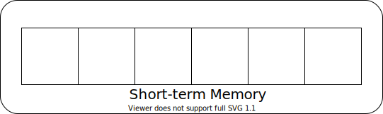
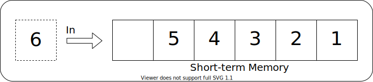
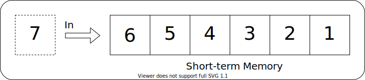
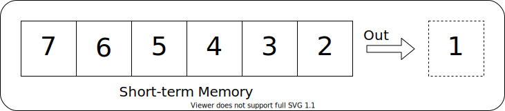
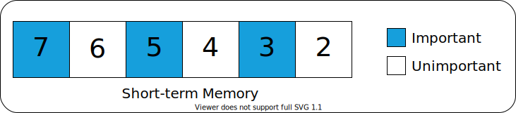
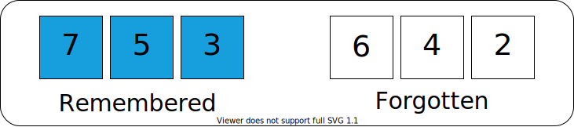

    
## Short-Term Memory 
<a href="#tldr">TL;DR</a>

---

 

The amount of information that can be stored in short-term memory can vary.

Modern research suggests that we can store between four and six pieces of information in short-term memory, depending on the complexity of each piece.

 

    

 

### As we focus on a subject, we fill up our short-term memory.

 

### Eventually, our short-term memory reaches capacity.

 

### If we force ourselves to continue focusing, old information is pushed out to make room for new information.

 

### Taking a break instead will allow our brain to determine which pieces of information important and which are not.

 

### The important information is encoded in long-term memory and the rest is forgotten.

 

 

---

<h2 id="tldr">TL;DR</h2>

 

Our short-term memory can only hold a few pieces of information at a time. To avoid frustration and increase recall, it's important to take frequent breaks while learning to allow information to be assimilated in to long-term memory.

 

---

    <a href="./3_modes_of_thinking.md"> < 3. Modes of Thinking </a> | 
    <a href="#top">Back to top &mapstoup;</a> |
    <a href="./5_chunking_and_spaced_review.md">5. Chunking & Spaced Review ></a>

 

[<< Table of Contents](/README.md) | [Visit our website >>](http://www.pdxcodeguild.com)

  

---

Created by Keegan Good, 2021

