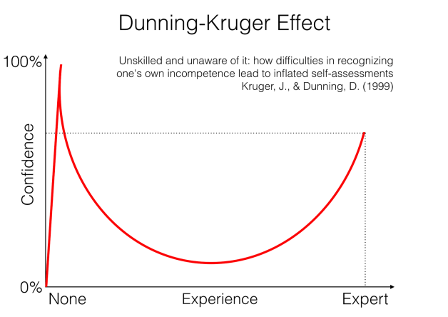

    
## Cognitive Biases
<a href="#tldr">TL;DR</a>

 

---

## Dunning Kruger Effect

 

### Beware the illusion of competence.

If we’ve studied something long enough, we might start to feel like we’re becoming masters in the subject.

We test our knowledge and when we pass our own test, we feel so accomplished that we become narrow-minded about acquiring more information. Suddenly, we’ve fooled ourselves into believing that we understand the subject more than we actually do and in doing so, we've hindered further learning.

It’s to our advantage to be open with ourselves about what we don’t know.

### When all is said and done, it is better to have an honest ignorance than a self-deceptive one.

 

 

The **Dunning Kruger Effect** is the cognitive bias behind the illusion of competence.

It causes people to believe that they are smarter and more capable than they really are.

Inexperienced people do not possess the wisdom needed to recognize the information they don’t know and this can cause them to be very confident in their incorrectness.

It is actually pretty easy to fall into this pattern when learning new information.

### To avoid falling victim to the Dunning Kruger Effect, practice the following on a regular basis:

 

### 1. Play devil's advocate

We should always check the information we feel like we understand. We should ask ourselves how we might be wrong and genuinely try to disprove ourselves.

 
 

### 2. Teach someone

Taking the time to explain the material to someone else and answer their questions will expose holes that might exist in our understanding.

 
 

### 3. Seek feedback

Ask for critiques from people you can trust who you know are highly skilled in your area of interest.

Be prepared to take constructive criticism and value the perspectives of those who share different viewpoints.

Don’t get defensive if someone disagrees with you, take it as an opportunity for growth.

 
 

### 4. Be humble

Don’t pretend to know something you don’t. Make it a priority to continue learning and growing.

 
 

### “In the beginner’s mind there are many possibilities, but in the expert’s there are few.”

 

― Shunryu Suzuki, Zen Mind, Beginner's Mind 

 
 

    <a href="#top">Back to top &mapstoup;</a>

---

    <h2>Imposter Syndrome</h2>

 

**Imposter Syndrome** is the opposite of the Dunning Kruger Effect.

### The more skilled we are, the more we feel like a fraud. 

This tends to make us think we’re not worthy and that we’re one wrong move away from being outed as the liars that we are.

**The only line of defense we have against this delusion is our perception of it**. Awareness is the first step to overcoming any obstacle and Imposter Syndrome no different.

Imposter syndrome can take on many forms and evoke a multitude of confusing emotions. Let’s take a look at some of the more common faces of Imposter Syndrome and some advice for dealing with them when they arise.

 

### 1. The Perfectionist

The Perfectionist tends to set unreasonable or even impossible goals and struggles with self-doubt when they inevitably cannot complete them. They tend to have trouble finishing projects because their work doesn’t live up to their own rigorous standards. They often feel like they “could have done a better job.”

### Advice:

- Stop dwelling on failures and give credit where credit is due.

- Aim to complete the "Minimal Viable Product", then add details later.

- Break large goals into lots of smaller goals, focus on one at a time.

- Celebrate small successes to reinforce self-worth.

 
 

### 2. The “Superhero”

The Superhero is always trying to work harder than everyone else to cover up feeling like a fraud amongst their ‘real-deal’ team mates. They are constantly thinking about work, pushing themselves to and even beyond their limits at the sacrifice of crucial downtime.

### Advice:

- Try not to seek validation from others, but rather from within oneself.

- Remember that breaks are just as conducive to success as proaction and time spent relaxing or being creative is essential for mental health.

- The quality of our work will benefit from us being happy and healthy, so let’s not rob ourselves of that by being too caught up in work.

 
 

### 3. The “Rugged Individualist”

Also known as “The Soloist”, the “Rugged Individualist” will often avoid asking for help because they see it as a sign of weakness and believe it would expose them as a fraud.

### Advice:

- No one exists in a vacuum. We are all intrinsically connected and we uphold each other through those connections.

- Knowing when to ask for help is a vital skill and will earn us respect and humility amongst our peers.

- If we’re working alone, we can’t help anyone else either. We’re denying the world the benefit of our knowledge and if we allow others to help us, our ideas will blossom much more readily. Two heads are better than one and many hands make light work.

 
 

### 4. The “Natural Genius”

The “Natural Genius” believes that if something costs them a lot of effort, it must mean that they are bad at it. They are reluctant to accept help from others and are too afraid of failure to try new things.

### Advice:

- Try measuring successes by the effort put into them and acknowledge the fact that no one can be great at everything.

- Instead of avoiding challenges see them as opportunities to learn and develop.

- Use areas of expertise to help others grow and learn

 
 

### 5. The “Expert”

The "Expert" is so caught up on the notion of achieving mastery of a skill that they lose all confidence in the skill they already possess.

They may feel like they actually have no right to the job they're doing and are just waiting their peers to find out how incompetent they really are. Perhaps They don’t even apply to certain jobs because They don’t have every single skill they mentioned in the job description.

### Advice:

- Skill gaps are normal and they don’t detract from what we already know

- There are many people out there applying because they have most of the skills required and are quite happy to develop the others on the job.

- Focus on existing skills and strengths , consciously note successes and making realistic plans to fill in any gaps.

 
 

---

 

### Imposter Syndrome is ***incredibly*** common. 

### We should always try not to be compassionate with ourselves when learning something new. 

### Everyone is unique and learns things in their own way and at their own pace.

 

---

    <h2 id="tldr">TL;DR</h2>

 

### Dunning Kruger Effect

The **Dunning Kruger Effect** is the cognitive bias that causes people to believe that they are smarter and more capable than they really are.

We can avoid this by always questioning our knowledge, especially if we think we have a good understanding of it.

 

    
### Imposter Syndrome
**Imposter Syndrome** is the persistent inability to believe that one's success is deserved or has been legitimately achieved as a result of one's own efforts or skills.

To avoid Imposter Syndrome in its many forms, celebrate small successes, take frequent breaks, don't be afraid to ask for help and don't worry too much about gaps in knowledge.

 
 

---

    <a href="./5_chunking_and_spaced_review.md"> < 5. Chunking & Spaced Review </a> | 
    <a href="#top">Back to top &mapstoup;</a> |
    <a href="./7_procrastination.md">7. Procrastination ></a>

 

[<< Table of Contents](/README.md) | [Visit our website >>](http://www.pdxcodeguild.com)

  

---

Created by Keegan Good, 2021

