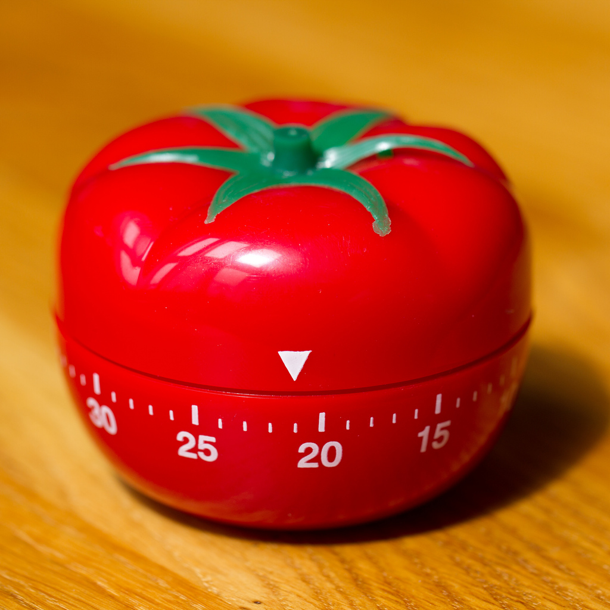

## Practical Study Techniques 
<a href="#tldr">TL;DR</a>

 

---

 
 

## Pomodoro Technique

 

The Pomodoro Technique was developed by **Francesco Cirillo** in the late 1980s. It involves using a timer to space out working intervals with breaks of different durations and is a great way to conquer procrastination. 

It is called the “Pomodoro” Technique after a uniquely-shaped analog timer shaped like a tomato.

 

 

In reality, any timer will work and there is a wide variety of phone apps that can also serve this purpose, as long as having one’s phone on one’s desk doesn’t prove to be distracting. 

 

The technique works like this:

### 1. Work for twenty-five minutes

### 2. Take a five minute break

Stretch, exercise, drink water, or practice the "20-20-20 Rule"

### 3. Repeat steps 1 and 2 three more times

### 4. Take a twenty minute break

Avoid screens and other distractions! Practice some diffuse thinking by going for a walk, taking a nap, meditating, or breathing deeply. Reward yourself for completing some work!

### 5. Return to step 1

Repeat steps 1 - 5 as many times as needed.

 

---
 

As we saw in the sections about the brain and memory, frequent breaks can facilitate learning by allowing the information in our short-term memory to be absorbed into long-term memory. 

Taking a little time to rest our brains after periods of work will leave us feeling less burnt-out at the end of the day, and we'll have achieved much more than if we had tried to do the same amount in a single work session.

 

    <a href="#top">Back to top &mapstoup;</a>

---

## Rubber Duck Technique

 

    
### One of the best ways to solidify knowledge is to explain it to someone else.

 

Teaching will expose any holes in one’s current understanding and will reinforce the points which are best understood. However, it can often be difficult to find a willing <s>victim</s> student to participate in the exercise. 

 

### Enter the rubber duck.

 

The rubber duck technique is primarily a method of debugging code, but can also be used when learning other subjects. 

The name is a reference to a story in the book *The Pragmatic Programmer* in which a programmer would carry around a rubber duck and debug their code by forcing themselves to explain it, line-by-line, to the duck. 

The rubber duck is a nice prop because it has a face, but in the absence of this very specific toy, other items can be substituted.

A set of googly eyes goes a long way in providing some much needed personality to your chosen inanimate student.

 
 

    <a href="#top">Back to top &mapstoup;</a>

---

 

## Effective Reading with OK4R

Despite the vast amount of content that can be found in video or audio format, **reading is still the most prevalent way that most people consume information**. 

It can be a little overwhelming to begin to tackle a large body of text pertaining to a certain subject. Developing an effective reading strategy can work wonders in terms of recalling the information later.

Instead of starting at the beginning and reading through to the end, we will complete assignments faster and remember more if we first take the time to follow the **OK4R reading method**.

Originally devised by *Dr. Walter Pauk*, OK4R is a reading strategy to help absorb as much content from reading material as possible. 

OK4R is an acronym which stands for **Overview**, **Key Ideas**, **Read**, **Recall**, **Reflect** and **Review**.

 
 

### 1. Overview
Go through the introduction, table of contents, headings, subheadings, summaries and diagrams to develop a **general idea** of what the study material is about and what to expect to learn from reading it.

### 2. Key Ideas

Go back through the key ideas of the study material. 

These are most often in the beginning of each paragraph or emphasized in some way – like bolded text, bullet points, pictures or graphs.

### 3. Read

Once we’ve outlined the key ideas and know a bit of what to expect, we can begin to read the study material while keeping the key ideas in mind.

### 4. Recall

At regular intervals, close the study material and try to recall as much as possible, especially in regards to the main points of the text. 

**Write down all the key points that you remember.**

### 5. Reflect

Reflect on the new knowledge by thinking of practical examples.

This is where we can **associate the new knowledge to what we already know**, and brainstorm new and creative applications of the information.

### 6. Review

We should **review the material often to refresh our memory and improve our recall**. Repetitions should be spaced out and **prioritize reviewing the details have been forgotten**.

 
 

The OK4R reading method compliments the chunking strategy outlined in previous sections. It will help to make a large body of text more approachable by breaking it down into smaller parts. Once each part is read, it’s connected back to the overall theme, thereby bolstering our understanding of the text as a whole.

 
 

    <a href="#top">Back to top &mapstoup;</a>

---

## As Within, So Without

 

### Humans are not separate from our environment.

 

The way we feel on the inside is directly influenced by our surroundings and the way we feel about our surroundings is influenced by how we feel inside. 

The tidiness of a room, the colors on the walls, the music in the background, and the amount of natural light we receive can all affect how we feel about ourselves and the world around us, whether we’re aware of it or not.

Our chosen study location and environment can heavily influence productivity and concentration when it comes time to learn.

 
 

### Take some time to set up a room or small area dedicated to studying.

Make your space comfortable, but not *too* comfortable.

### Clear away distractions

Make sure the area is free of clutter and that the space is aesthetically pleasing enough to want to spend a fair amount of time there. 

### Cast out the darkness

If possible, choose a naturally lit location for studying, or consider purchasing a full-spectrum lamp. 

### Remove clutter

Be intentional about the objects that are kept in the space. 

### Choose the right tunes

If music is to be played in the background, opt for music with minimal lyrics, allowing one’s own thoughts to fill the void. 

### Bring nature to you

Keep a few houseplants around for some company and fresh oxygen (some googly eyes could even transform the plants into excellent students to teach as we learn). 

### Ditch the devices

Turn off or silence phones and other devices and keep them out of reach. 

### Promote thinking

Try keeping some fidget toys around to play with while pondering. These can also help reduce stress.

 
 

    <a href="#top">Back to top &mapstoup;</a>

---

    <h2 id="tldr">TL;DR</h2>

 

## Pomodoro Technique

 

The **Pomodoro Technique** involves using a timer to space out working intervals with breaks of different durations.

 

The technique works like this:

1. Work for twenty-five minutes

2. Take a five minute break 

3. Repeat steps 1 and 2 four times

4. Take an extended break of twenty minutes

5. Return to step 1

 

Avoid screens and other distractions during breaks. Instead, use them to exercise, drink water or practice diffuse thinking.

 

---

## Rubber Duck Technique

 

The **Rubber Duck Technique** is founded in the notion that teaching something to someone else will solidify our knowledge of that subject. 

In the absence of a human student, we can substitue a rubber duck or other inanimate object.

 

---

## OK4R

 

**OK4R** is a technique for effectively reading learning materials.

**OK4R** is an arcronym for

1. **Overview** - A quick glance over the material to see what might be covered. Look at headings, subheadings, summaries and diagrams

2. **Key Ideas** - Outline the important points of the text. Look at bold text, graphs, images and bulleted points 

3. **Read** - Read the study material while keeping the key ideas in mind.

4. **Reflect** - Reflect on the new knowledge. Associate the new knowledge to what we already know and brainstorm new and creative applications of the information.

5. **Recall** - At regular intervals, close the study material and try to recall as much as possible, especially regarding the main points of the text. 

6. **Review** - Review the material often to refresh our memory and improve our recall. Repetitions should be spaced out and **prioritize reviewing the details have been forgotten**.

 

---

    <h2>As Within, So Without</h2>

 

Our study environment can have a big impact on our learning.  Take some time to set up a room or small area specifically for studying.

 

Make your space comfortable, but not *too* comfortable.

1. Clear away distractions / clutter. Turn off or silence phones and other devices and keep them out of reach. 

2. Choose a naturally lit location for studying, or consider purchasing a full-spectrum lamp

4. Opt for music with minimal lyrics, allowing one's own thoughts to fill the void

5. Keep a few houseplants around for some company and fresh oxygen

 

---

    <a href="./7_procrastination.md"> < 7. Practical Study Techniques </a> | 
    <a href="#top">Back to top &mapstoup;</a> |
    <a href="./9_pdx_code_guild.md">9. PDX Code Guild ></a>

 

[<< Table of Contents](/README.md) | [Visit our website >>](http://www.pdxcodeguild.com)

  

---

Created by Keegan Good, 2021

