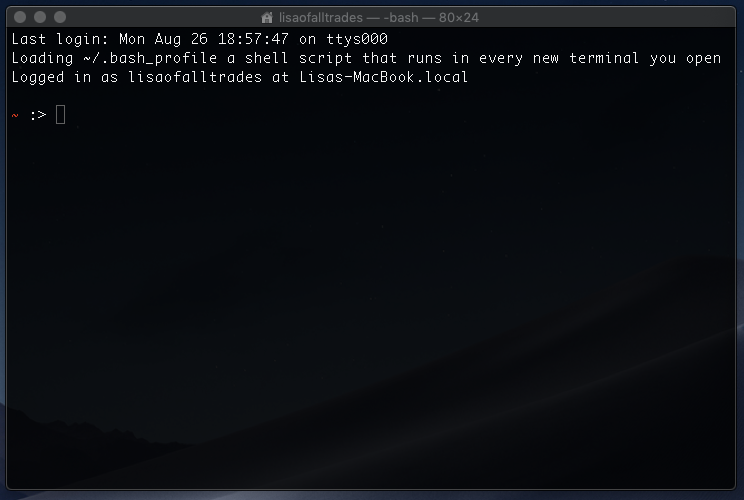
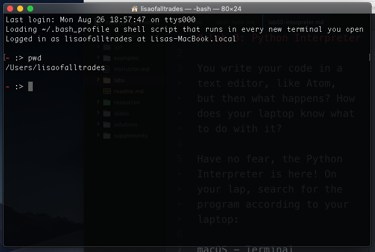
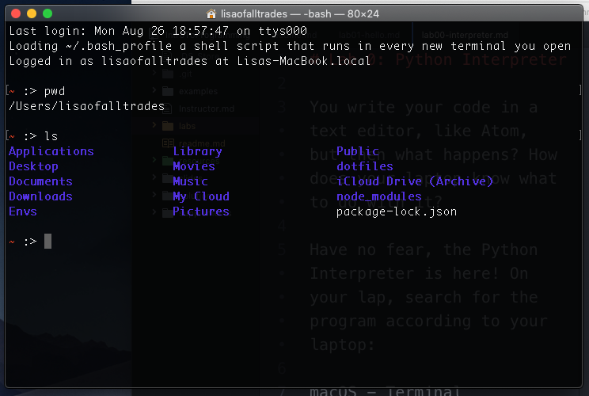
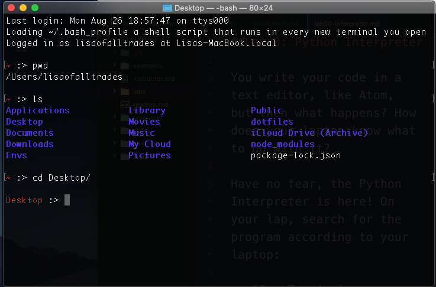
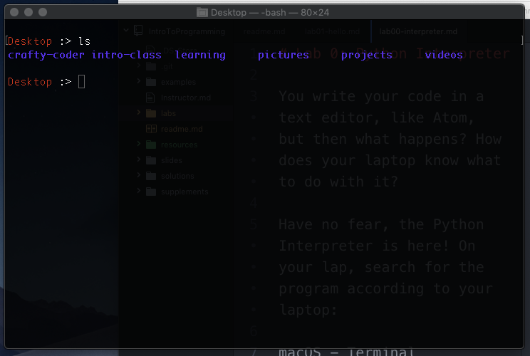
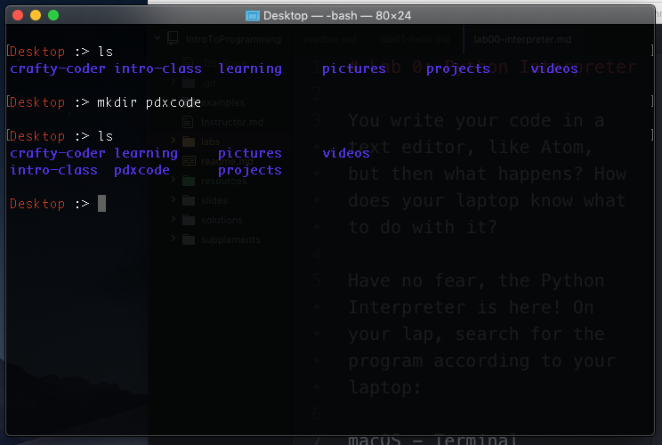
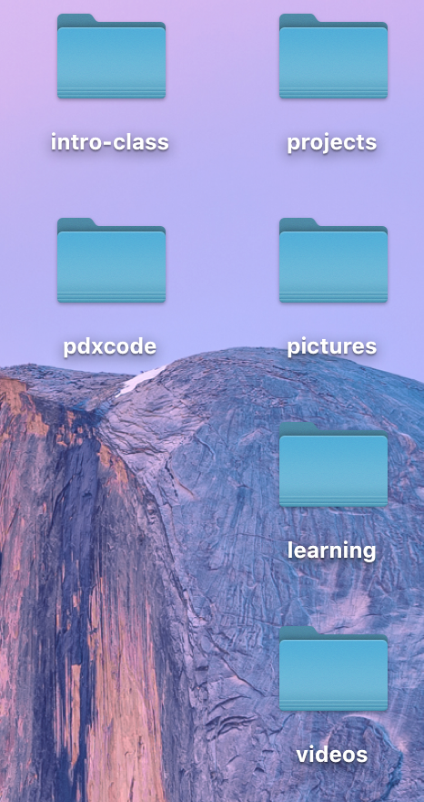

# Lab 01 (completed) <a id="top"></a>

- [Back to Lab 01](lab01.md)
- [Back to Unit 00](../units/unit-0.md)
- [Back to Syllabus](../README.md)

After opening the program, mac users will see something like this:



The root sign, **~**, means you're in the root of your computer. For windows, it will be your username.
```
C:\Users\lisanguyen06>
```
 Doesn't make sense? Don't worry, it will soon. Follow the directions below and things should start to make more sense.

### Where am I?

To see your current directory, type the following command into your terminal and hit enter:

```bash
# mac/linux
pwd

# Windows
cd
```
This will print the path of the directory (or folder) that you're in.



### What's in this folder?

Next, type **ls** in your terminal/command line to list all the folders and files available in the current directory:

```bash
# mac/linux/ Windows
ls
```
As you can see, here are all the folders and files in the **root** directory. The one we're interested in is **Desktop**.



### Moving into a folder

To get to Desktop. Type **cd Desktop** into the terminal/command line. **Capitalization matters.**

```bash
# mac/linux/ Windows
cd Desktop
```



Notice that the path changes from **~** to **Desktop**. That's how you know what folder you're in.

Type **ls** again in your terminal/command line to list all the folders and files available on your Desktop!

```bash
ls
```


Pretty neat, right? Now we're going to make some changes to your Desktop.

### Creating a new folder

In terminal/command line, type **mkdir pdxcode**.

```bash
# mac/linux/ Windows
mkdir pdxcode
```
Type **ls** again:
```bash
ls
```


Do you see the difference? **pdxcode** is now on your Desktop. To double check, you can go find the folder on the your Desktop:



Go back to terminal and let's navigate into the folder **pdxcode**.

Hint: After typing the characters, **pdx**, hit tab. The terminal will auto-complete the file name! Isn't that cool?

```bash
# mac/linux/ Windows
cd pdx # type this then hit tab

# Ad a result, you should see "cd pdxcode".
# Then hit enter.
```
Notice that the path changes from **Desktop** to **Desktop\pdxcode>**. That's how you know what folder you're in.

### Conclusion
With the terminal, we've navigated around the computer and created a new folder on the Desktop. The folder that we created will be where we save all our labs. If you had a hard time remembering all the commands, you can use this [terminal cheatsheet](lab01.md). It's also linked on the main page of the [syllabus](../README.md)

[Back to top](#top)
